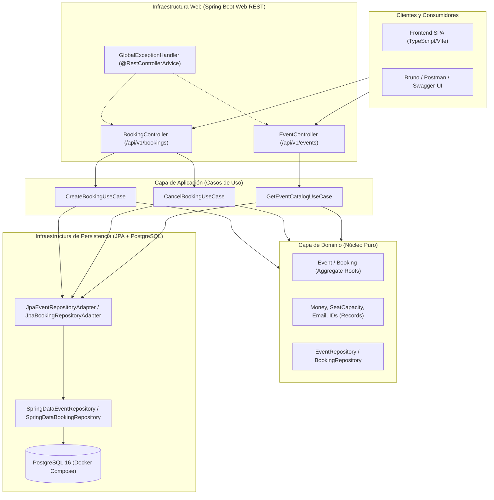

# 🎟️ NeonPulse Ticketing Platform

[](https://github.com/your-username/Fundamentos_de_Java_Globant_Talento_Ready/actions)
[](https://spring.io/projects/spring-boot)
[](https://www.postgresql.org/)
[](https://www.docker.com/)
[](https://swagger.io/)
[]()
[](https://www.typescriptlang.org/)

> **Programa:** Fundamentos de Java — **Globant Talento Ready / {desafío} latam_**  
> **Proyecto Full-Stack Autónomo:** Sistema de Gestión, Emisión y Reserva de Entradas para Eventos (*NeonPulse Ticketing*).

---

## 📋 Resumen de Hitos del Proyecto

| Hito | Área | Tecnologías | Criterios Clave Cumplidos |
| :---: | :--- | :--- | :--- |
| **Hito 1** | **Backend / Core de Dominio Puro** | Java 17+, JUnit 5, Mockito 5, JaCoCo | • Modelo de dominio puro en Java sin acoplamiento a frameworks.<br>• Suite automatizada bajo el **Patrón AAA (Arrange, Act, Assert)**.<br>• Excepciones de negocio con `assertThrows` y dobles de prueba con Mockito.<br>• **100% de cobertura lógica (Line/Branch Coverage)** verificada con JaCoCo. |
| **Hito 2** | **Frontend Dinámico** | TypeScript (Strict), Vite, HTML5, CSS3 | • **Tipado hermético en TS:** Cero uso de `any`, enums e interfaces estrictas.<br>• **Renderizado seguro del DOM:** Guardias de tipo contra nulidad y captura con `preventDefault()`.<br>• **Asincronía moderna:** Funciones con `async/await`, bloques `try/catch/finally` y estados visuales de carga (spinners y feedback en pantalla). |
| **Hito 3** | **Arquitectura Limpia & DDD** | Java 17+ Records, Clean Architecture, DDD | • **Separación en capas desacopladas:** `domain` (puro), `application` (casos de uso) e `infrastructure` (adaptadores).<br>• **Patrones tácticos DDD:** Entidades, Aggregate Roots y Value Objects inmutables con `record` (`Email`, `Money`, `SeatCapacity`, IDs).<br>• **Contratos de Repositorios:** Casos de uso desacoplados por inyección por constructor. |
| **Hito 4** | **Microservicios, Persistencia & Docker** | Spring Boot 3, PostgreSQL, JPA, Docker Compose, Swagger UI | • **Endpoints REST Semánticos:** `/api/v1/events` y `/api/v1/bookings` con `@RestControllerAdvice` centralizado.<br>• **Persistencia Relacional Real:** PostgreSQL 16 virtualizado con `docker-compose.yml` y mapeo JPA/Hibernate con `JpaRepository`.<br>• **OpenAPI y Perfiles Seguros:** Swagger-UI activo en `dev` y herméticamente bloqueado en `prod`. Colección HTTP para Bruno/Postman. |

---

## 🏛️ Arquitectura de Microservicio y Capas Limpias (Hito 4)

El backend de NeonPulse combina **Clean Architecture (DDD)** con el ecosistema productivo de **Spring Boot 3**:



---

## 📁 Estructura Global del Repositorio

```text
.
├── docker-compose.yml                         # Virtualización de PostgreSQL 16
├── pom.xml                                    # Descriptor Maven (Spring Boot 3 + JPA + Swagger)
├── README.md                                  # Documentación técnica de todos los Hitos
├── contracts/
│   └── neonpulse-api.http                     # Colección HTTP para Bruno, Postman o VSCode REST Client
├── src/
│   ├── main/
│   │   ├── java/com/desafiolatam/ticketing/
│   │   │   ├── NeonPulseApplication.java      # Entry point Spring Boot 3
│   │   │   ├── domain/                        # Dominio Puro (Aggregates, Value Objects, Repositorios)
│   │   │   ├── application/                   # Casos de Uso (CreateBooking, CancelBooking, GetCatalog)
│   │   │   └── infrastructure/
│   │   │       ├── config/                    # Configuración OpenAPI (@Profile dev) y Beans
│   │   │       ├── persistence/               # Entidades JPA, JpaRepository y Adaptadores
│   │   │       └── web/                       # Controladores REST y @RestControllerAdvice
│   │   └── resources/
│   │       ├── application.yml                # Configuración base
│   │       ├── application-dev.yml            # Perfil dev (PostgreSQL + Swagger activo)
│   │       ├── application-prod.yml           # Perfil prod (Swagger bloqueado)
│   │       ├── application-test.yml           # Perfil test (H2 in-memory)
│   │       └── data.sql                       # Semilla de eventos iniciales
│   └── test/
│       └── java/com/desafiolatam/ticketing/   # Tests de Dominio, Casos de Uso y MockMvc
└── frontend/                                  # Frontend Dinámico (TypeScript + Vite)
```

---

## 🐳 Despliegue de Base de Datos con Docker Compose (Hito 4)

Para levantar la base de datos PostgreSQL en tu entorno local:

```bash
# 1. Iniciar el contenedor de PostgreSQL en segundo plano
docker compose up -d

# 2. Verificar que el contenedor esté saludable (healthy)
docker compose ps

# 3. Para detener el contenedor cuando finalices
docker compose down
```

---

## 🚀 Ejecución del Backend con Spring Boot 3

```bash
# 1. Compilar y ejecutar la suite de pruebas unitarias e integración
mvn clean test

# 2. Iniciar el microservicio con el perfil de desarrollo (dev)
mvn spring-boot:run -Dspring-boot.run.profiles=dev

# 3. Acceder a Swagger-UI en el navegador (solo en dev)
# URL: http://localhost:8080/swagger-ui.html
# API Docs JSON: http://localhost:8080/v3/api-docs
```

---

## 📡 Endpoints REST y Manejo de Errores

| Método | Endpoint | Descripción | Código Éxito | Códigos Error Controlados |
| :---: | :--- | :--- | :---: | :---: |
| `GET` | `/api/v1/events` | Consulta de la cartelera completa de eventos | `200 OK` | `500` |
| `GET` | `/api/v1/events/{id}` | Consulta de evento específico por identificador | `200 OK` | `404 NOT_FOUND` |
| `POST` | `/api/v1/bookings` | Emisión y compra de entradas con descuento por tier | `201 CREATED` | `400 BAD_REQUEST`, `402 PAYMENT_REQUIRED`, `404 NOT_FOUND`, `409 CONFLICT` |
| `POST` | `/api/v1/bookings/{id}/cancel` | Anulación de reserva y liberación de inventario | `200 OK` | `400 BAD_REQUEST`, `404 NOT_FOUND` |

### Formato Unificado de Error (`@RestControllerAdvice`):
```json
{
  "timestamp": "2026-08-30T17:00:00",
  "status": 409,
  "error": "Conflict",
  "message": "Stock insuficiente: Solicitaste 50 entradas pero solo quedan 5 disponibles.",
  "path": "/api/v1/bookings"
}
```

---

## ⚡ Ejecución del Frontend (Hito 2)

```bash
cd frontend
npm install
npm run dev
# URL: http://localhost:3000
```

