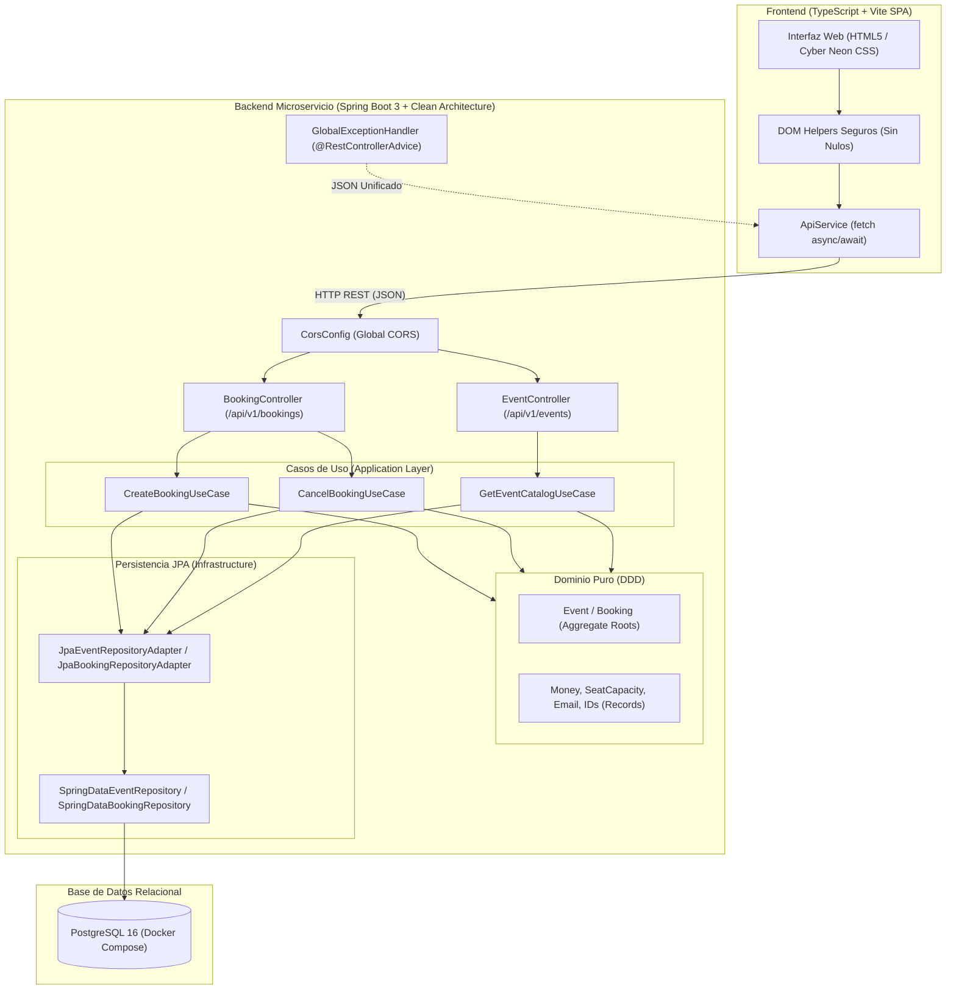

# 🎟️ NeonPulse Ticketing Platform — Entrega Final Consolidada

[](https://github.com/LudwigEspinosa/Fundamentos_de_Java_Globant_Talento_Ready/actions)
[](https://spring.io/projects/spring-boot)
[](https://www.postgresql.org/)
[](https://www.docker.com/)
[](https://swagger.io/)
[]()
[](https://www.typescriptlang.org/)
[]()

> **Programa:** Fundamentos de Java — **Globant Talento Ready / {desafío} latam_**  
> **Proyecto Full-Stack Autónomo:** Sistema de Gestión, Emisión y Reserva de Entradas para Eventos (*NeonPulse Ticketing*).

---

## 📋 Resumen Integral de Hitos y Ramas del Repositorio

| Hito | Dimensión Evaluada | Tecnologías Clave | Logros y Cumplimiento Técnico | Rama en GitHub |
| :---: | :--- | :--- | :--- | :---: |
| **Hito 1** | **Backend / Core de Dominio Puro** | Java 17+, JUnit 5, Mockito 5, JaCoCo | • Modelo de dominio puro en Java sin acoplamiento a frameworks.<br>• Suite automatizada bajo el **Patrón AAA (Arrange, Act, Assert)**.<br>• Excepciones de negocio y dobles de prueba con Mockito.<br>• **100% de cobertura lógica (Line & Branch Coverage)** con JaCoCo. | [🌿 **`Hito1`**](https://github.com/LudwigEspinosa/Fundamentos_de_Java_Globant_Talento_Ready/tree/Hito1) |
| **Hito 2** | **Frontend Dinámico** | TypeScript (Strict), Vite, HTML5, CSS3 | • **Tipado hermético en TS:** Cero uso de `any`, enums e interfaces estrictas.<br>• **Renderizado seguro del DOM:** Guardias de tipo contra nulidad y captura con `preventDefault()`.<br>• **Asincronía moderna:** Funciones con `async/await`, bloques `try/catch/finally` y estados de carga. | [🌿 **`Hito2`**](https://github.com/LudwigEspinosa/Fundamentos_de_Java_Globant_Talento_Ready/tree/Hito2) |
| **Hito 3** | **Arquitectura Limpia & DDD** | Java 17+ Records, Clean Architecture, DDD | • **Separación en capas desacopladas:** `domain` (puro), `application` (casos de uso) e `infrastructure` (adaptadores).<br>• **Patrones tácticos DDD:** Entidades, Aggregate Roots y Value Objects inmutables con `record` (`Email`, `Money`, `SeatCapacity`, IDs).<br>• **Contratos de Repositorios:** Inyección por constructor y casos de uso POJO. | [🌿 **`Hito3`**](https://github.com/LudwigEspinosa/Fundamentos_de_Java_Globant_Talento_Ready/tree/Hito3) |
| **Hito 4** | **Microservicios, Persistencia & Docker** | Spring Boot 3, PostgreSQL, JPA, Docker Compose | • **Endpoints REST Semánticos:** `/api/v1/events` y `/api/v1/bookings` con `@RestControllerAdvice` centralizado.<br>• **Persistencia Relacional Real:** PostgreSQL 16 con `docker-compose.yml` y mapeo JPA/Hibernate con `JpaRepository`.<br>• **OpenAPI y Perfiles:** Swagger-UI activo en `dev` y herméticamente bloqueado en `prod`. | [🌿 **`Hito4`**](https://github.com/LudwigEspinosa/Fundamentos_de_Java_Globant_Talento_Ready/tree/Hito4) |
| **Hito Final** | **Integración Full-Stack & Producción** | Full-Stack Integration, CORS, Security | • **Ciclo End-to-End Real:** Cliente TypeScript conectado con `fetch` al backend Spring Boot y PostgreSQL.<br>• **Políticas CORS:** Configuración perimetral libre de bloqueos de origen cruzado.<br>• **Seguridad de Producción:** Exclusión absoluta de credenciales en Git (`.env.example`), `.gitignore` estricto y Swagger aislado por perfiles. | [🌿 **`Final`**](https://github.com/LudwigEspinosa/Fundamentos_de_Java_Globant_Talento_Ready/tree/Final) |

---

## 🏛️ Arquitectura Full-Stack Consolidada



---

## 📁 Estructura del Repositorio

```text
Fundamentos_de_Java_Globant_Talento_Ready/
├── .env.example                               # Plantilla de variables de entorno seguras
├── docker-compose.yml                         # Virtualización de PostgreSQL 16 para desarrollo
├── pom.xml                                    # Descriptor Maven (Spring Boot 3 + JPA + Swagger + JaCoCo)
├── README.md                                  # Documentación técnica completa (Hitos 1 al Final)
├── contracts/
│   └── neonpulse-api.http                     # Colección HTTP para Bruno, Postman o VS Code REST Client
├── src/
│   ├── main/
│   │   ├── java/com/desafiolatam/ticketing/
│   │   │   ├── NeonPulseApplication.java      # Entry point Spring Boot 3
│   │   │   ├── domain/                        # Capa de Dominio Puro (Aggregates, Records, Repositorios)
│   │   │   ├── application/                   # Capa de Aplicación (Casos de Uso)
│   │   │   └── infrastructure/                # Capa de Infraestructura (Web REST, JPA, Config, Swagger)
│   │   └── resources/
│   │       ├── application.yml                # Configuración base (perfil activo: dev)
│   │       ├── application-dev.yml            # Perfil dev (PostgreSQL + Swagger activo)
│   │       ├── application-prod.yml           # Perfil prod (Swagger bloqueado herméticamente)
│   │       ├── application-test.yml           # Perfil test (H2 in-memory)
│   │       └── data.sql                       # Semilla de datos iniciales
│   └── test/
│       └── java/com/desafiolatam/ticketing/   # Suite de pruebas unitarias y MockMvc (100% Cobertura)
└── frontend/                                  # Frontend Dinámico en TypeScript + Vite
    ├── .env.example                           # Plantilla de configuración del frontend
    ├── index.html                             # SPA de cartelera y checkout
    ├── package.json                           # Scripts y dependencias de Vite
    ├── tsconfig.json                          # Configuración TypeScript en modo estricto
    ├── vite.config.ts                         # Configuración de Vite
    └── src/
        ├── types/index.ts                     # Modelos, enums e interfaces estrictas (Cero 'any')
        ├── services/api.service.ts            # Cliente fetch asíncrono hacia Spring Boot
        ├── dom/                               # Selectores seguros contra nulos y UI renderer
        ├── style.css                          # Estilos Cyber Neon / Glassmorphism
        └── main.ts                            # Controlador principal y listeners
```

---

## 🚀 Guía de Puesta en Marcha Rápida (End-to-End)

### 1. Iniciar la Base de Datos con Docker Compose
```bash
docker compose up -d
# Verifica que el contenedor esté saludable:
docker compose ps
```

### 2. Iniciar el Microservicio Backend (Spring Boot 3)
```bash
# Ejecutar tests y validar cobertura
mvn clean test

# Iniciar servidor en perfil de desarrollo
mvn spring-boot:run -Dspring-boot.run.profiles=dev

# Consola de Swagger-UI disponible en:
# http://localhost:8080/swagger-ui.html
```

### 3. Iniciar el Frontend (TypeScript + Vite)
```bash
cd frontend
npm install
npm run dev

# Aplicación web disponible en:
# http://localhost:5173  (o http://localhost:3000)
```

---

## 🔒 Pautas de Seguridad de Grado de Producción Cumplidas

1. **Exclusión Absoluta de Secretos:**  
   Ninguna contraseña, secreto o llave se expone en el código ni en el historial de Git. Toda configuración sensible se gestiona a través de variables de entorno y plantillas `.env.example`.
2. **Swagger y OpenAPI Aislados:**  
   La consola de Swagger-UI y el endpoint `/v3/api-docs` están activos únicamente bajo el perfil `dev` mediante anotación `@Profile({"dev", "test"})` y propiedades en `application-dev.yml`. En el perfil `prod` quedan herméticamente deshabilitados para evitar exponer la superficie de ataque.
3. **Manejo Centralizado de Errores:**  
   El interceptor perimetral `@RestControllerAdvice` captura todas las excepciones de negocio y validación, retornando un JSON uniforme sin exponer jamás trazas nativas ni stacktraces internos del servidor.

