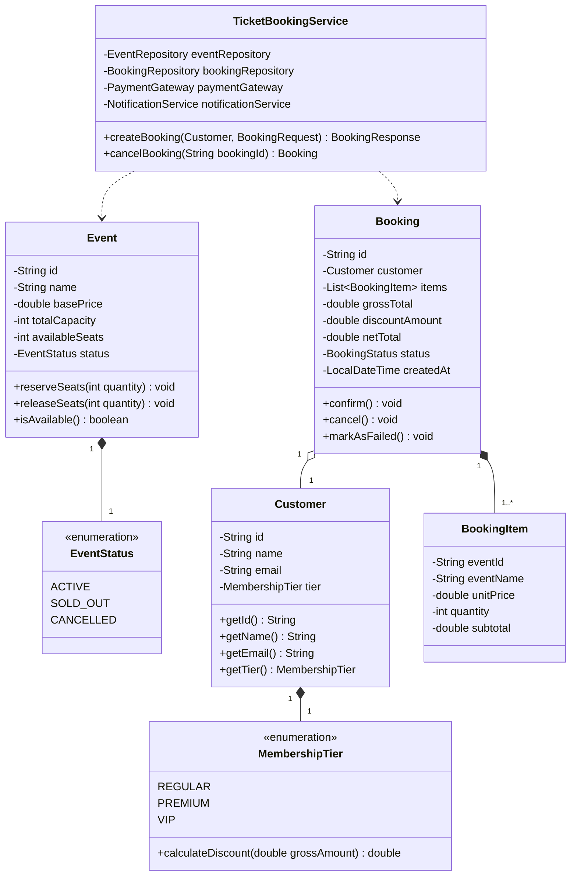

# 🎟️ NeonPulse Ticketing Core - Hito 1

[](https://github.com/your-username/neonpulse-ticketing-core/actions)
[](https://opensource.org/licenses/MIT)
[]()

> **Módulo:** Fundamentos de Calidad y TDD en Java — **{desafío} latam_**  
> **Entregable:** Hito 1 — Core de Dominio Puro, Suite Automatizada con JUnit 5 & Mockito (Patrón AAA) y Cobertura 100% con JaCoCo.

---

## 📋 Tabla de Contenidos

1. [Descripción del Proyecto](#-descripción-del-proyecto)
2. [Glosario Técnico de Negocio (Ubiquitous Language)](#-glosario-técnico-de-negocio-ubiquitous-language)
3. [Arquitectura del Dominio Puro](#-arquitectura-del-dominio-puro)
4. [Estructura del Proyecto](#-estructura-del-proyecto)
5. [Estrategia de Pruebas y Patrón AAA](#-estrategia-de-pruebas-y-patrón-aaa)
6. [Métricas de Cobertura (JaCoCo 100%)](#-métricas-de-cobertura-jacoco-100)
7. [Requisitos Previos y Ejecución](#-requisitos-previos-y-ejecución)

---

## 📖 Descripción del Proyecto

**NeonPulse Ticketing Core** es un motor transaccional de gestión, reserva y emisión de entradas para eventos desarrollado en **Java puro**. El sistema implementa las reglas de negocio críticas para la venta de tickets garantizando:

- **Desacoplamiento total:** Libre de dependencias a frameworks de persistencia (JPA/Hibernate) o infraestructura web (Spring), asegurando portabilidad y testabilidad pura.
- **Control estricto de concurrencia y stock:** Validación de capacidad de asientos (`Event.reserveSeats`) con transiciones de estado automáticas (`ACTIVE` $\to$ `SOLD_OUT`) y mecanismos de rollback seguro (`Event.releaseSeats`) en caso de rechazo del pago.
- **Reglas de Descuento por Nivel de Cliente:** Cálculo dinámico de beneficios comerciales según el tier del cliente (`REGULAR` 0%, `PREMIUM` 10%, `VIP` 20%).
- **Aislamiento de Dependencias:** Inyección por constructor de interfaces/puertos (`EventRepository`, `BookingRepository`, `PaymentGateway`, `NotificationService`) para permitir pruebas unitarias 100% aisladas mediante dobles de prueba con **Mockito**.

---

## 📚 Glosario Técnico de Negocio (Ubiquitous Language)

| Término (Inglés) | Concepto en Español | Definición y Regla de Negocio |
| :--- | :--- | :--- |
| **`Customer`** | Cliente / Usuario | Entidad que realiza la reserva. Posee un identificador único, nombre, correo electrónico válido y un nivel de membresía (`MembershipTier`). |
| **`MembershipTier`** | Nivel de Membresía | Clasificación comercial del cliente: `REGULAR` (0% descuento), `PREMIUM` (10% descuento) y `VIP` (20% descuento). |
| **`Event`** | Evento | Entidad que administra el inventario de asientos. Controla el precio base, capacidad total, asientos disponibles y su estado (`EventStatus`). |
| **`EventStatus`** | Estado del Evento | `ACTIVE` (disponible para reservas), `SOLD_OUT` (agotado) o `CANCELLED` (cancelado/inactivo). |
| **`Booking`** | Reserva / Orden | Agregado raíz que agrupa los ítems adquiridos, cliente, cálculo del monto bruto, descuento comercial aplicado, total neto y estado de la orden (`BookingStatus`). |
| **`BookingItem`** | Ítem de Reserva | Objeto de valor que representa la cantidad de entradas y el subtotal para un evento específico. |
| **`BookingStatus`** | Estado de la Reserva | `PENDING` (en proceso), `CONFIRMED` (pago aprobado y emitida), `FAILED` (pago rechazado), `CANCELLED` (anulada). |
| **`PaymentGateway`** | Pasarela de Pagos | Puerto de salida encargado del cobro financiero. Si falla, el sistema ejecuta rollback de inventario. |
| **`NotificationService`** | Servicio de Notificaciones | Puerto de salida para despachar correos/alertas de confirmación o fallos transaccionales. |

---

## 🏛️ Arquitectura del Dominio Puro



---

## 📁 Estructura del Proyecto

```text
.
├── .github/
│   └── workflows/
│       └── ci.yml                             # Pipeline automatizado GitHub Actions
├── .gitignore                                 # Exclusiones de build, Maven y entornos IDE
├── pom.xml                                    # Descriptor Maven con JUnit 5, Mockito y JaCoCo
├── README.md                                  # Documentación técnica completa
└── src/
    ├── main/
    │   └── java/
    │       └── com/desafiolatam/ticketing/
    │           └── domain/
    │               ├── dto/
    │               │   ├── BookingRequest.java
    │               │   └── BookingResponse.java
    │               ├── exception/
    │               │   ├── DomainException.java
    │               │   ├── EventNotFoundException.java
    │               │   ├── EventNotActiveException.java
    │               │   ├── InsufficientSeatsException.java
    │               │   ├── InvalidBookingException.java
    │               │   └── PaymentFailedException.java
    │               ├── model/
    │               │   ├── Booking.java
    │               │   ├── BookingItem.java
    │               │   ├── BookingStatus.java
    │               │   ├── Customer.java
    │               │   ├── Event.java
    │               │   ├── EventStatus.java
    │               │   └── MembershipTier.java
    │               ├── port/
    │               │   ├── BookingRepository.java
    │               │   ├── EventRepository.java
    │               │   ├── NotificationService.java
    │               │   └── PaymentGateway.java
    │               └── service/
    │                   └── TicketBookingService.java
    └── test/
        └── java/
            └── com/desafiolatam/ticketing/
                └── domain/
                    ├── dto/
                    │   └── BookingDtoTest.java
                    ├── exception/
                    │   └── DomainExceptionsTest.java
                    ├── model/
                    │   ├── BookingItemTest.java
                    │   ├── BookingTest.java
                    │   ├── CustomerTest.java
                    │   ├── EventTest.java
                    │   └── MembershipTierTest.java
                    └── service/
                        └── TicketBookingServiceTest.java
```

---

## 🧪 Estrategia de Pruebas y Patrón AAA

Todas las pruebas unitarias están implementadas bajo la estructura rigurosa del patrón **AAA (Arrange, Act, Assert)**:

```java
@Test
@DisplayName("Should successfully create booking for REGULAR customer with 0% discount")
void shouldCreateBookingSuccessfullyForRegularCustomer() {
    // Arrange
    Customer customer = createCustomer("CUST-REG", MembershipTier.REGULAR);
    BookingRequest request = new BookingRequest("EVT-01", 2);
    Event event = createEvent("EVT-01", 50.0, 10);

    when(eventRepository.findById("EVT-01")).thenReturn(Optional.of(event));
    when(paymentGateway.charge("CUST-REG", 100.0)).thenReturn(true);
    when(bookingRepository.save(any(Booking.class))).thenAnswer(invocation -> invocation.getArgument(0));

    // Act
    BookingResponse response = bookingService.createBooking(customer, request);

    // Assert
    assertNotNull(response);
    assertEquals("Test Customer", response.getCustomerName());
    assertEquals(100.0, response.getTotalPaid(), 0.001);
    assertEquals(BookingStatus.CONFIRMED, response.getStatus());
    assertEquals(8, event.getAvailableSeats());

    verify(eventRepository, times(1)).save(event);
    verify(notificationService, times(1)).sendBookingConfirmation(eq(customer), any(Booking.class));
}
```

### Características Principales de la Suite de Pruebas:
- **Control de Excepciones Semánticas:** Uso de `assertThrows` validando el tipo y mensaje exacto de error.
- **Pruebas Paramétricas:** Uso de `@ParameterizedTest`, `@CsvSource`, `@ValueSource`, `@EnumSource` y `@NullAndEmptySource` para cubrir múltiples combinaciones y valores de borde.
- **Aislamiento Total con Mockito:** Simulación de contratos mediante `@Mock`, `@InjectMocks`, `when().thenReturn()`, `verify()`, `verifyNoInteractions()` y `ArgumentCaptor`.

---

## 📊 Métricas de Cobertura (JaCoCo 100%)

El archivo `pom.xml` incluye la regla de verificación estricta de JaCoCo:

```xml
<rule>
    <element>BUNDLE</element>
    <limits>
        <limit>
            <counter>LINE</counter>
            <value>COVEREDRATIO</value>
            <minimum>1.00</minimum>
        </limit>
        <limit>
            <counter>BRANCH</counter>
            <value>COVEREDRATIO</value>
            <minimum>1.00</minimum>
        </limit>
    </limits>
</rule>
```

Para generar y visualizar el informe HTML de cobertura:
```bash
mvn clean test jacoco:report
```
El informe se generará en: `target/site/jacoco/index.html`.

---

## 🚀 Requisitos Previos y Ejecución

### Requisitos:
- **JDK 17** o superior
- **Apache Maven 3.8+**

### Comandos de Ejecución:

1. **Compilar el proyecto:**
   ```bash
   mvn clean compile
   ```

2. **Ejecutar la suite de tests unitarios:**
   ```bash
   mvn test
   ```

3. **Verificar la cobertura de código (100% Line/Branch):**
   ```bash
   mvn jacoco:check
   ```

4. **Empaquetar el proyecto:**
   ```bash
   mvn package
   ```

