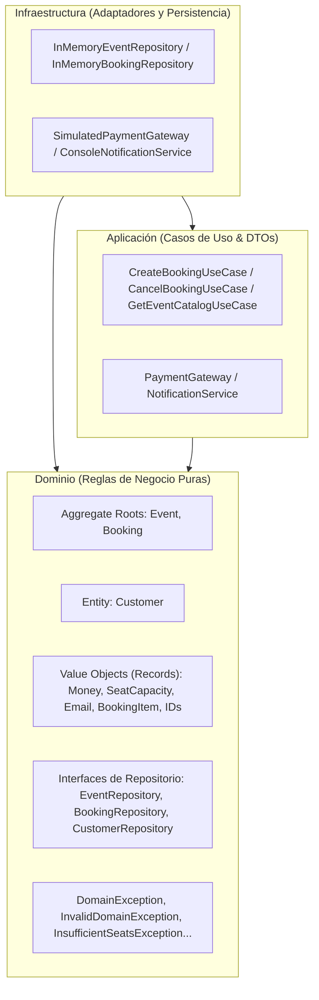

# 🎟️ NeonPulse Ticketing Platform

[](https://github.com/your-username/Fundamentos_de_Java_Globant_Talento_Ready/actions)
[]()
[](https://www.typescriptlang.org/)
[](https://vitejs.dev/)
[]()

> **Programa:** Fundamentos de Java — **Globant Talento Ready / {desafío} latam_**  
> **Proyecto Full-Stack Autónomo:** Sistema de Gestión, Emisión y Reserva de Entradas para Eventos (*NeonPulse Ticketing*).

---

## 📋 Resumen de Hitos del Proyecto

| Hito | Área | Tecnologías | Criterios Clave Cumplidos |
| :---: | :--- | :--- | :--- |
| **Hito 1** | **Backend / Core de Dominio Puro** | Java 17+, JUnit 5, Mockito 5, JaCoCo | • Modelo de dominio puro en Java sin acoplamiento a frameworks.<br>• Suite automatizada bajo el **Patrón AAA (Arrange, Act, Assert)**.<br>• Excepciones de negocio con `assertThrows` y dobles de prueba con Mockito.<br>• **100% de cobertura lógica (Line/Branch Coverage)** verificada con JaCoCo. |
| **Hito 2** | **Frontend Dinámico** | TypeScript (Strict), Vite, HTML5, CSS3 | • **Tipado hermético en TS:** Cero uso de `any`, enums e interfaces estrictas.<br>• **Renderizado seguro del DOM:** Guardias de tipo contra nulidad y captura con `preventDefault()`.<br>• **Asincronía moderna:** Funciones con `async/await`, bloques `try/catch/finally` y estados visuales de carga (spinners y feedback en pantalla). |
| **Hito 3** | **Arquitectura Limpia & DDD** | Java 17+ Records, Clean Architecture, DDD | • **Separación en capas desacopladas:** `domain` (puro), `application` (casos de uso) e `infrastructure` (adaptadores en memoria).<br>• **Patrones tácticos DDD:** Entidades, Aggregate Roots y Value Objects inmutables con `record` (`Email`, `Money`, `SeatCapacity`, IDs).<br>• **Contratos de Repositorios:** Casos de uso desacoplados por inyección por constructor. |

---

## 🏛️ Arquitectura Limpia y Diseño Guiado por el Dominio (Hito 3)

El backend de Java implementa los principios de **Clean Architecture** (Arquitectura Limpia) y **Domain-Driven Design (DDD)** con la siguiente regla de dependencias:



---

## 📁 Estructura Global del Repositorio

```text
.
├── .github/
│   └── workflows/
│       └── ci.yml                             # Pipeline CI para Backend Java y JaCoCo
├── .gitignore                                 # Exclusiones para Java, Maven, Node y Vite
├── pom.xml                                    # Descriptor Maven del Backend (Hitos 1 y 3)
├── README.md                                  # Documentación técnica completa (Hitos 1, 2 y 3)
├── src/                                       # Backend Java en Capas Limpias (Hitos 1 y 3)
│   ├── main/java/com/desafiolatam/ticketing/
│   │   ├── domain/                            # CAPA DE DOMINIO (Pura, sin frameworks)
│   │   │   ├── model/
│   │   │   │   ├── aggregate/                 # Event (Root), Booking (Root)
│   │   │   │   ├── entity/                    # Customer
│   │   │   │   ├── valueobject/               # Money, SeatCapacity, Email, BookingItem, IDs (records)
│   │   │   │   └── enumtype/                  # EventStatus, BookingStatus, MembershipTier
│   │   │   ├── exception/                     # Jerarquía de excepciones de negocio
│   │   │   └── repository/                    # Contratos de repositorios (EventRepository, etc.)
│   │   │
│   │   ├── application/                       # CAPA DE APLICACIÓN (Casos de Uso)
│   │   │   ├── dto/                           # BookingRequestDTO, BookingResponseDTO, EventResponseDTO
│   │   │   ├── port/                          # PaymentGateway, NotificationService
│   │   │   └── usecase/                       # CreateBookingUseCase, CancelBookingUseCase, GetEventCatalogUseCase
│   │   │
│   │   └── infrastructure/                    # CAPA DE INFRAESTRUCTURA (Adaptadores)
│   │       ├── adapter/                       # SimulatedPaymentGateway, ConsoleNotificationService
│   │       └── persistence/inmemory/          # InMemoryEventRepository, InMemoryBookingRepository...
│   │
│   └── test/java/com/desafiolatam/ticketing/  # Suite de pruebas unitarias AAA y Mockito (100% Cobertura)
│       ├── domain/...                         # Tests de Value Objects, Records, Entidades y Agregados
│       ├── application/...                    # Tests de Casos de Uso con dobles de prueba Mockito
│       └── infrastructure/...                 # Tests de adaptadores y repositorios en memoria
│
└── frontend/                                  # Aplicación Frontend Dinámica (Hito 2)
    ├── index.html                             # SPA de cartelera y reserva de tickets
    ├── package.json                           # Configuración y scripts de Vite y TypeScript
    ├── tsconfig.json                          # Configuración TypeScript en modo estricto
    ├── vite.config.ts                         # Configuración del servidor de desarrollo Vite
    └── src/
        ├── types/index.ts                     # Interfaces, Enums y DTOs herméticos
        ├── services/                          # API asíncrona (async/await) y validador
        ├── dom/                               # Selectores seguros contra nulos y UI renderer
        ├── style.css                          # Estilos Cyber Neon / Glassmorphism
        └── main.ts                            # Controlador principal y listeners
```

---

## 🎯 Patrones Tácticos de DDD Implementados (Hito 3)

### 1. Objetos de Valor Inmutables con Java `record`
- **`Email`:** Auto-valida formato con expresión regular y normaliza a minúsculas.
- **`Money`:** Encapsula operaciones financieras de suma, resta, multiplicación y comparación, redondeando a 2 decimales y previniendo valores negativos.
- **`SeatCapacity`:** Controla la capacidad total y asientos disponibles, asegurando que `0 <= available <= total` y proveyendo métodos `reserve` y `release`.
- **`BookingItem`:** Línea de detalle inmutable que auto-calcula su subtotal como `unitPrice * quantity`.
- **Identificadores fuertemente tipados (`EventId`, `CustomerId`, `BookingId`):** Eliminan el *Primitive Obsession* evitando confusiones de IDs genéricos de tipo `String`.

### 2. Entidades y Agregados (Aggregate Roots)
- **`Event` (Aggregate Root):** Protege la consistencia de su inventario (`SeatCapacity`) y transiciones de estado (`ACTIVE` $\leftrightarrow$ `SOLD_OUT`).
- **`Booking` (Aggregate Root):** Encapsula su lista de `BookingItem`s, valida el cliente y garantiza el cálculo matemático de su total bruto, descuento y total neto.
- **`Customer` (Entity):** Representa al cliente con ciclo de vida e identidad basada en su `CustomerId`.

### 3. Casos de Uso Desacoplados por Contratos
- **`CreateBookingUseCase`:** Orquesta la validación, reserva de asientos en el agregado, cálculo de descuentos por membresía, cobro en pasarela y despacho de notificaciones con rollback automático si el pago es rechazado.
- **`CancelBookingUseCase`:** Libera los asientos en el evento correspondiente y marca la orden como `CANCELLED`.
- **`GetEventCatalogUseCase`:** Retorna la lista de eventos disponibles mapeados a DTOs de salida.

---

## 🧪 Ejecución de Tests y Cobertura 100% con JaCoCo

```bash
# 1. Compilar clases Java
mvn clean compile

# 2. Ejecutar la suite completa de tests unitarios (JUnit 5 + Mockito)
mvn test

# 3. Validar regla de Cobertura Matemática del 100% con JaCoCo
mvn jacoco:check

# 4. Generar reporte HTML de cobertura
mvn jacoco:report
# Reporte disponible en: target/site/jacoco/index.html
```

---

## ⚡ Ejecución del Frontend (Hito 2)

```bash
cd frontend

# 1. Instalar dependencias
npm install

# 2. Iniciar servidor de desarrollo
npm run dev

# 3. Compilar para producción (Typecheck + Bundling)
npm run build
```

